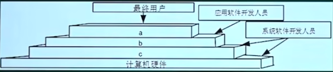

### 操作系统-概述

- 管理系统的硬件、软件、数据资源
- 控制程序运行
- 人机之间的接口
- 应用软件与硬件之间的接口

#### 任务可分为

- 进程管理
- 存储管理
- 文件管理
- 作业管理
- 设备管理

## 真题

#### 1. 计算机系统的层次结构如下图所示，基于硬件之上的软件可分为 a、b 和 c 三个层次，图中 a、b 和 c 分别表示（）

- A、操作系统、系统软件和应用软件
- B、操作系统、应用软件和系统软件
- C、应用软件、系统软件和操作系统
- D、应用软件、操作系统和系统软件

> 答案：C
