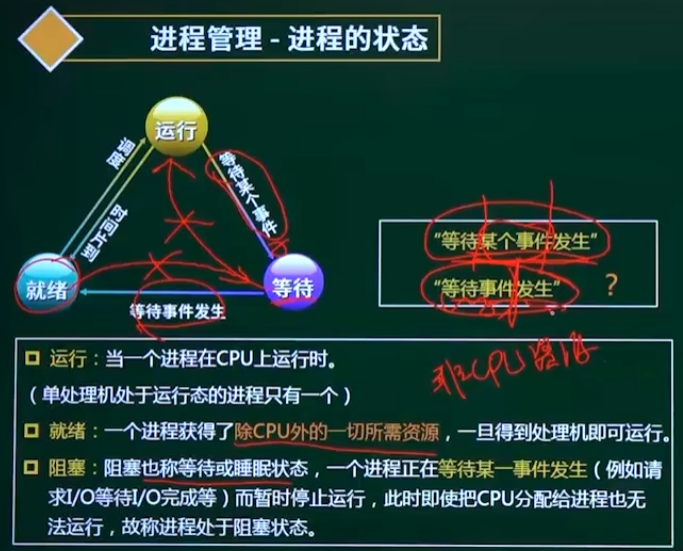
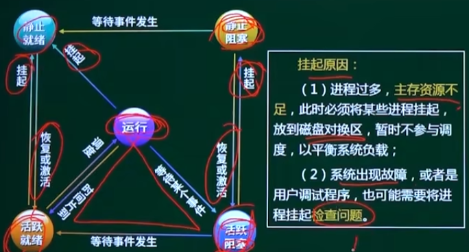

### 进程管理-进程的状态

- 运行：当一个进程在 CPU 运行时（单处理机处于运行态的进程只有一个）
- 就绪：一个进程获得了`除CPU外的一切所需资源`，一旦得到处理机即可运行。
- 阻塞：阻塞也称等待或睡眠状态，一个进程正在`等待某一件事发生`（例如请求 I/O 等待 I/O 完成等）而暂时停止运行，此时即时把 CPU 分配给进程也无法运行，故称进程处于阻塞状态。

## 真题

#### 1. 在单处理机系统中，采用先来先服务调度算法。系统中有 4 个进程 P1、P2、P3、P4(假设进程按此顺序达到)，其中 P1 为运行状态，P2 为就绪状态，P3 和 P4 为等待状态，且 P3 等待打印机，P4 等待扫描仪。若 P1()，则 P1、P2、P3 和 P4 的状态应分为别()。

- A、时间片到
- B、释放了打印机
- C、释放了打印机
- D、已完成

> 答案：A

- A、等待、就绪、等待和等待
- B、运行、就绪、运行和等待
- C、就绪、运行、等待和等待
- D、就绪、就绪、等待和运行

> 答案：C
