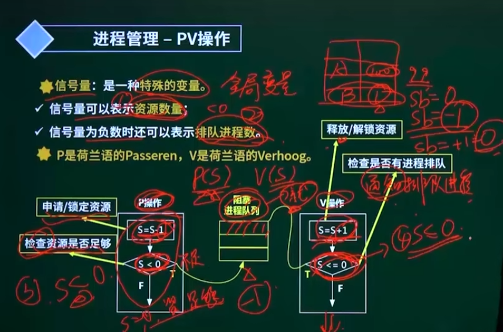

### 进程管理-进程的同步与互斥

- `临界资源`：诸进程间需要互斥方式对其进行共享的资源。(进程中访问临界资源的那段`代码`称为`临界区`)

* 互斥：许多人同时抢一张椅子（间接制约关系）
* 同步：速度有差异，在一定情况下停下等待（直接制约关系）

## 真题

#### 1. PV 操作是操作系统提供的具有特定功能的原语。利用 PV 操作可以（）

- A、保证系统不发生死锁
- B、实现资源的互斥使用
- C、提高资源利用率
- D、推迟进程使用共享资源的时间（临界资源来进行控制的）

> 答案：B

#### 2. 假设系统中有 n 个进程共享三台扫描仪，并采用 PV 操作实现进程同步与互斥。若系统信号量 S 的当前值为-1，进程 p1、p2 又分别执行了 1 次 p(S)操作，那么信号量 s 的值应该为()

- A、3
- B、-3
- C、1
- D、-1

> 答案：B
